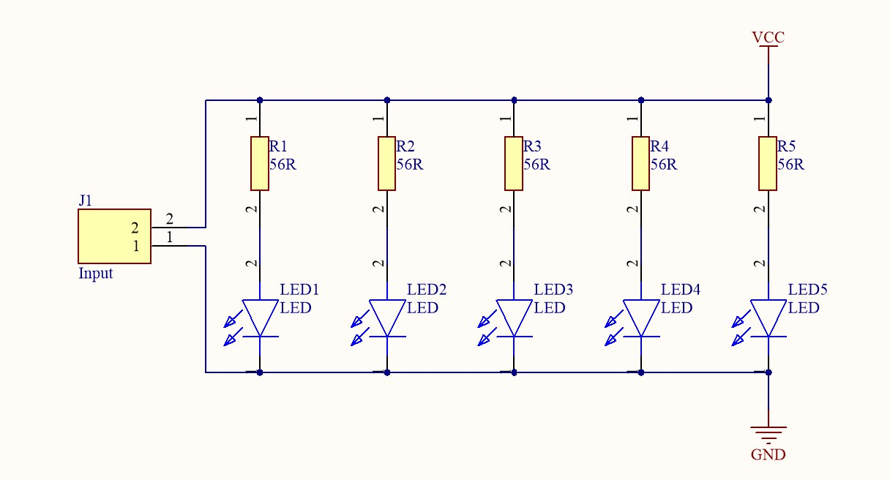
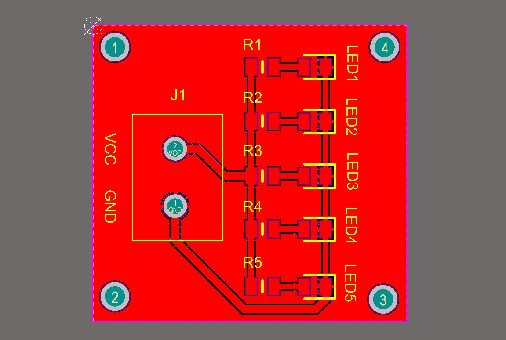
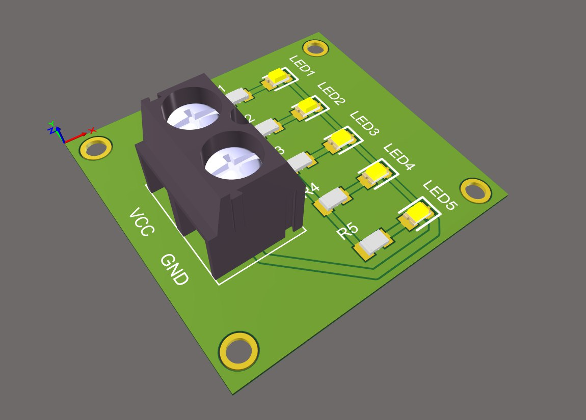
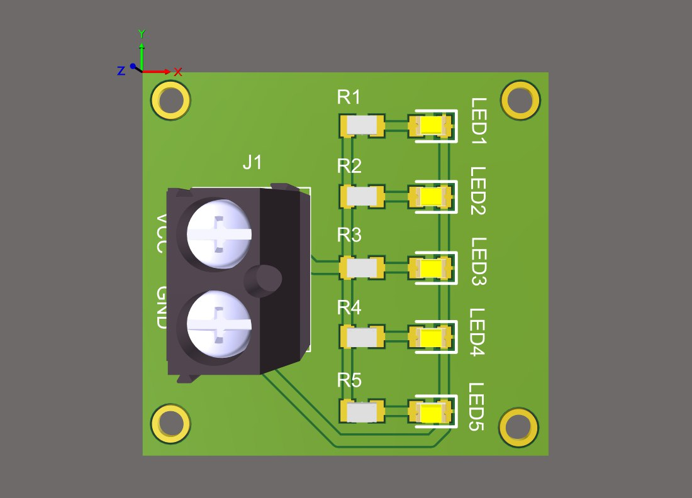

# Módulo de LEDs con Componentes SMD en Altium Designer

Este repositorio contiene los archivos de diseño de un módulo electrónico compacto de iluminación basado en **LEDs** de montaje superficial (**SMD**). El proyecto fue desarrollado en **Altium Designer** y es un excelente ejemplo para quienes deseen practicar el diseño de placas de circuito impreso (PCB) con componentes SMD para aplicaciones de señalización, indicadores o iluminación de bajo consumo.

## 📝 Descripción del Proyecto

El módulo está diseñado para ser simple y eficiente. Utiliza LEDs y resistencias en formato SMD para lograr un tamaño reducido y un aspecto moderno. El diseño es ideal para proyectos que requieren una solución de iluminación compacta o para estudiantes que están aprendiendo a trabajar con la tecnología de montaje superficial.

### Características Clave

* **Diseño SMD:** Componentes de montaje superficial para un factor de forma pequeño.
* **Módulo de LEDs:** Funciona como un indicador o una fuente de iluminación.
* **Desarrollado en Altium Designer:** Incluye archivos de esquemático (`.SchDoc`) y de PCB (`.PcbDoc`).
* **Ideal para Prototipos:** Útil para proyectos de electrónica que requieran un módulo de señalización sencillo.

---

## ⚙️ Lista de Componentes

A continuación, se detalla la lista de todos los componentes necesarios para ensamblar el módulo.

| Designator       | Description | Footprint   | Quantity |
| :--------------- | :---------- | :---------- | :------- |
| J1               | Connector   | 1760510000  | 1        |
| LED1, LED2, LED3, LED4, LED5 | LED         | LEDC2012X90N| 5        |
| R1, R2, R3, R4, R5 | Resistor  | RESC2012X50N| 5        |

---

## 📸 Imágenes del Proyecto

### 1. Esquema Eléctrico

### 2. PCB

### 3. Vista Ortogonal

### 4. Vista Superior

---

## 🚀 Cómo usar este repositorio

1.  **Clona el repositorio:** `git clone https://github.com/ingwplanchez/altium-leds-smd.git`
2.  **Abre el proyecto en Altium Designer:** Navega a la carpeta del proyecto y abre el archivo `.PrjPcb`.
3.  **Visualiza y fabrica:** Explora el esquemático y la PCB. Puedes generar los archivos de fabricación (Gerber) directamente desde Altium para mandar a producir tu placa.